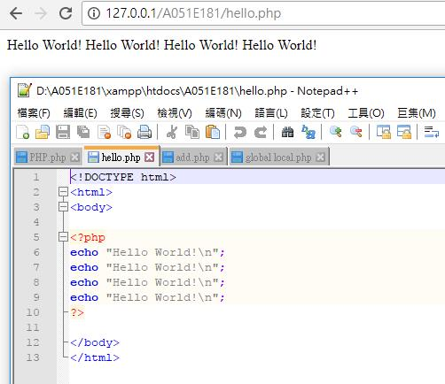
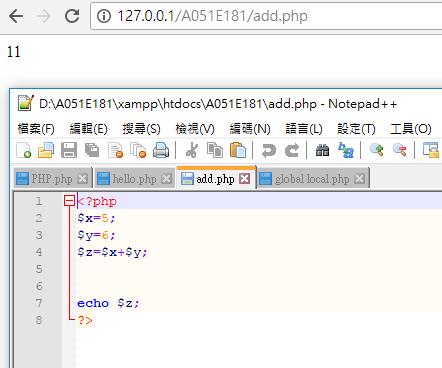
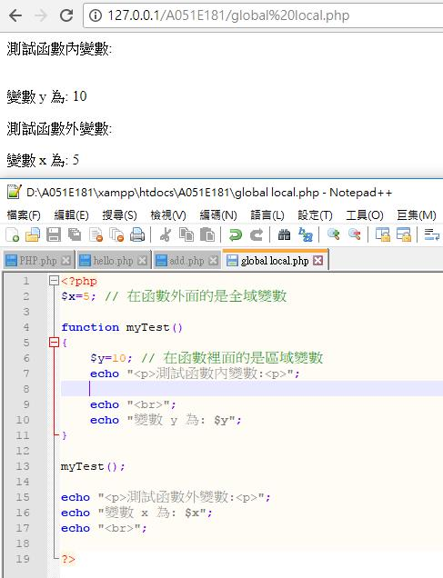
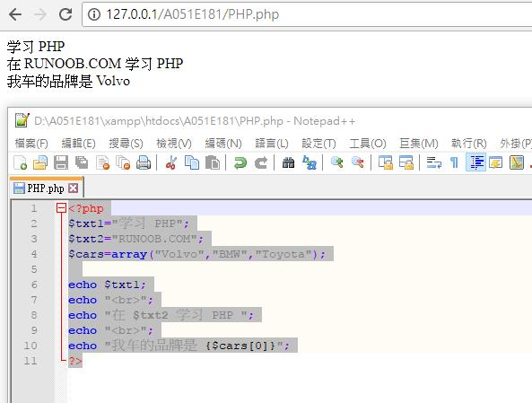
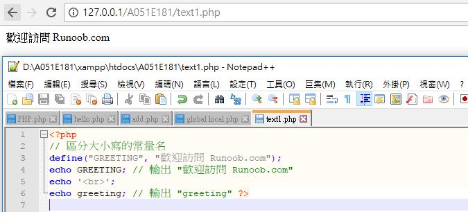

# XAMPP安裝

# 啟動XAMPP

使用系統管理員身分啟動下列執行檔===>xampp-control.exe

# XAMPP目錄結構

D:\xampp

D:\xampp\htdocs===>放你的網站程式

建一個目錄把測試程式放在此目錄

D:\xampp\htdocs\dragon

開啟瀏覽器

http://127.0.0.1:8008/dashboard/

#程式範例

###程式範例一:
```
<!DOCTYPE html> 
<html> 
<body> 

<?php 
echo "Hello World!\n"; 
echo "Hello World!\n"; 
echo "Hello World!\n"; 
echo "Hello World!\n"; 
?> 
```
</body> 
</html>

 

###程式範例二:
```
<?php
$x=5;
$y=6;
$z=$x+$y;


echo $z;
?>
```



###程式範例三:
```
<?php 
$x=5; // 在函數外面的是全域變數 

function myTest() 
{ 
    $y=10; // 在函數裡面的是區域變數 
    echo "<p>測試函數內變數:<p>"; 
    
    echo "<br>"; 
    echo "變數 y 為: $y"; 
}  

myTest(); 

echo "<p>測試函數外變數:<p>"; 
echo "變數 x 為: $x"; 
echo "<br>"; 

?>
```



###程式範例四:
```
<?php
$txt1="学习 PHP";
$txt2="RUNOOB.COM";
$cars=array("Volvo","BMW","Toyota");
 
echo $txt1;
echo "<br>";
echo "在 $txt2 学习 PHP ";
echo "<br>";
echo "我车的品牌是 {$cars[0]}";
?>
```



###程式範例五:
```
<?php 
// 區分大小寫的常量名 
define("GREETING", "歡迎訪問 Runoob.com"); 
echo GREETING; // 輸出 "歡迎訪問 Runoob.com" 
echo '<br>'; 
echo greeting; // 輸出 "greeting" ?>

 

<?php 
$txt1="Hello world!"; 
$txt2="What a nice day!"; 
echo $txt1 . " " . $txt2; 
?>
```
 

